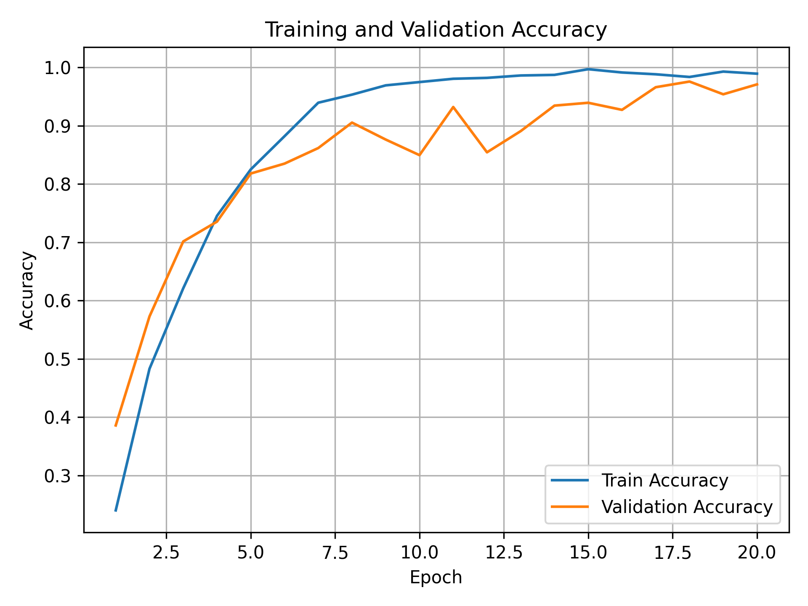

# OmniVLA Language-Guided Navigation (ROS 2 + Gazebo)

A modular **ROS 2 Jazzy** and **Gazebo Harmonic** project for **language-guided robot navigation**, combining **Vision-Language Models (OmniVLA-edge)** with **Nav2** for reliable execution.

This project focuses on bridging **semantic understanding (language + vision)** with **classical navigation systems**, enabling robots to interpret human commands and navigate accordingly.


## Demo Video
[](https://www.youtube.com/watch?v=JP31pXTPZl8)

---

## Workspace Architecture

This project follows a modular and scalable "Separation of Concerns" design:

```text
omnivla_ws/
├── OmniVLA/                  # Base VLA model (pretrained)
│
├── omnivla_finetune/         # Finetuning + classifier training
│   ├── checkpoints/
│   └── training scripts
│
├── src/
│   ├── bcr_bot/              # Robot + Gazebo simulation
│   │
│   ├── omnivla_bringup/      # Launch files + configs
│   │   ├── launch/
│   │   └── config/
│   │
│   ├── omnivla_core/         # Runtime system
│   │   ├── inference_node.py
│   │   ├── nav2_goal_bridge_node.py
│   │   └── model_client.py
│   │
│   ├── omnivla_data/         # Data collection pipeline
│   │   ├── episode_manager_node.py
│   │   └── data_logger_node.py
│   │
│   └── omnivla_eval/         # (optional) evaluation tools
│
├── datasets/                 # collected episodes
└── README.md
```

---

## System Pipeline

The navigation system integrates learning-based perception with classical planning:

```text
Language Prompt
        ↓
OmniVLA Inference (image + prompt)
        ↓
Predicted Goal ID
        ↓
Goal Library (ID → Pose)
        ↓
Nav2 Planner & Controller
        ↓
Robot Navigation
```

- Language → semantic goal  
- Goal → pose (via goal library)  
- Pose → execution (Nav2)  

---

## Quick Start

### 1. Prerequisites

- Ubuntu 24.04  
- ROS 2 Jazzy  
- Gazebo Harmonic  
- Nav2  

or Ubuntu 22.04 + Distrobox setup 


#### Environment Setup (optional)

The project environment is managed using Conda. The required dependencies were exported using:

```bash
conda env export > environment.yml
```

To recreate the environment:

```bash
conda env create -f environment.yml
conda activate <environment_name>
```

---

### 2. Build the Workspace

```bash
cd ~/ros2_projects/omnivla_ws
colcon build --symlink-install
source install/setup.bash
```

Clean rebuild if needed:
```bash
rm -rf build install log
colcon build --symlink-install
source install/setup.bash
```

---

### 3. Run Language-Guided Navigation

#### Launch system
```bash
ros2 launch omnivla_bringup inference_nav.launch.py
```

#### Send prompt
```bash
ros2 topic pub --once /omnivla/prompt std_msgs/msg/String "{data: 'go to the small shelf row'}"
```

---

## Data Collection Pipeline

The data collection pipeline automatically samples semantic goals from `goal_library.yaml`, generates language prompts, sends target poses to Nav2, and logs synchronized camera/odometry data for each navigation episode.

### Start collection launch
```bash
ros2 launch omnivla_bringup data_collection.launch.py
```

### Start / stop episode collection
```bash
ros2 service call /omnivla_data/start_collection std_srvs/srv/Trigger
ros2 service call /omnivla_data/stop_collection std_srvs/srv/Trigger
```

By default, collected episodes are saved under the output directory configured in `collection.yaml`, for example:

```text
datasets/run_002/
├── episode_0001/
│   ├── metadata.json
│   └── frames/
│       ├── 0000.png
│       ├── 0000.json
│       └── ...
└── episode_0002/
```

### Export collected episodes to goal-classifier JSONL

After collecting episodes, export the raw ROS episode folders into train/validation JSONL files for OmniVLA-edge goal-classifier finetuning:

```bash
python3 ./omnivla_finetune/export_goal_classifier_jsonl.py \
  --run-dir ./datasets/run_002 \
  --goal-library ./src/omnivla_bringup/config/goal_library.yaml \
  --out-dir ./datasets/goal_classifier_run_002 \
  --keep-every-n 2 \
  --success-only
```

Example exported structure:

```text
datasets/goal_classifier_run_002/
├── train.jsonl
├── val.jsonl
└── label_map.json
```

Optional: export the raw collected episodes into an HDF5 dataset format:

```bash
python3 ./src/omnivla_data/omnivla_data/export_utils.py \
  --input ./datasets/run_002 \
  --output ./datasets/export/omnivla_dataset.h5
```

---

## Model Finetuning
The decoder, film_model, and compress modules were unfrozen during finetuning, resulting in about 100,000 trainable parameters.

```bash
python3 ./omnivla_finetune/train_omnivla_edge_classifier.py \
  --train-jsonl ./datasets/goal_classifier_run_002/train.jsonl \
  --val-jsonl ./datasets/goal_classifier_run_002/val.jsonl \
  --checkpoint-path ./omnivla-edge/omnivla-edge.pth \
  --num-classes 10 \
  --epochs 20 \
  --batch-size 4 \
  --feature-mode actions \
  --lr 5e-5 \
  --dropout 0.3 \
  --unfreeze-patterns decoder,film_model,compress \
  --num-workers 4 \
  --save-path omnivla_finetune/checkpoints/test1/omnivla_edge_goal_classifier.pt \
  --device cuda

```

Best validation accuracy achieved:

```
val_acc = 0.9757
```

<p align="center">
  
</p>

---

## Key Features

- Language-guided navigation  
- Vision-Language-Action (VLA) integration  
- Modular ROS2 system design  
- Automated dataset collection pipeline  
- Robust fallback (rule-based inference)  
- Easily extendable goal library  

---

## Design Highlights

- Hybrid architecture combining learning and classical planning  
- Semantic goal abstraction instead of raw pose prediction  
- Scalable data pipeline for iterative improvement  

---

## Maintainer

- **Andy Tsai**  
M.S. Robotics & Autonomous Systems @ ASU  
andystsai104@gmail.com  
https://github.com/andytsai104  
<br>

- **Alan Cheng**  
M.S. Robotics & Autonomous Systems @ ASU  
hcheng57@asu.edu  
https://github.com/Ott3rAlan9Ol2S  
<br>

- **Roy Yu**  
M.S. Robotics & Autonomous Systems @ ASU  
mengjuyu@asu.edu  
https://github.com/roy0823  
<br>

- **Kalyani Kasar**  
M.S. Robotics & Autonomous Systems @ ASU  
kkasar@asu.edu  
https://github.com/kalyaniKasar1  

---

## References & Resources

This project builds on the following upstream repositories:

- [OmniVLA](https://github.com/NHirose/OmniVLA/tree/main) for the base vision-language-action model
- [bcr_bot](https://github.com/blackcoffeerobotics/bcr_bot/tree/ros2-jazzy?tab=readme-ov-file#jazzy--harmonic-ubuntu-2404) for the robot simulation platform
- ROS 2 Navigation Stack (Nav2)  
- Gazebo Harmonic simulation  
- ROS 2 documentation  
